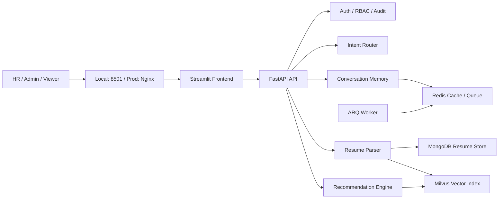

# 智能招聘 RAG 推荐系统

面向 HR、招聘经理和管理员的智能招聘平台，支持自然语言搜人、简历上传解析、多轮追问、候选人对比和后台管理。

本次重构后，项目不再把所有职责混在一起，而是明确拆分为 `FastAPI API`、`Streamlit Frontend` 和 `ARQ Worker` 三类运行单元，并补齐了生产环境 `docker-compose.prod.yml`、Nginx 反向代理、独立前端镜像和更清晰的模块边界。

## 核心能力

- 自然语言搜索：像和猎头对话一样描述岗位需求，系统自动抽取条件并检索候选人。
- 多轮对话记忆：支持“再推几个”“学历高一点”“范围缩小到杭州”这类连续追问。
- 简历上传解析：支持 PDF、DOCX、JSON 简历入库，自动抽取结构化字段并做 PII 处理。
- 候选人管理：支持简历查看、筛选、编辑、软删除、候选人对比和会话历史查看。
- 角色权限控制：内置 `admin`、`hr`、`viewer` 三类角色，不同页面和接口按权限开放。
- 运维可观测：提供健康检查、系统仪表盘、Swagger/ReDoc 文档和容器健康探针。

## 重构后的架构



- 本地开发使用 `docker-compose.yml`，直接暴露 `8000` 和 `8501`。
- 生产部署使用 `docker-compose.prod.yml`，由 Nginx 统一对外提供 `/` 和 `/api`。
- `arq-worker` 已纳入部署拓扑，当前提供基础 worker 配置，便于后续把上传/索引流程进一步异步化。

## 核心模块

| 模块 | 路径 | 说明 |
| --- | --- | --- |
| API 层 | `src/api/` | FastAPI 入口、认证、上传、对话和聊天接口 |
| 公共基础设施 | `src/common/` | 配置、日志、JWT、权限中间件、用户存储、Worker 配置 |
| 意图路由 | `src/intent_router/` | 意图分类、槽位抽取、回退策略 |
| 对话记忆 | `src/conversation_memory/` | 会话状态、上下文合并、搜索范围决策 |
| 推荐引擎 | `src/recommendation_engine/` | Query Builder、混合检索、过滤、重排、推荐理由生成 |
| 简历解析 | `src/resume_parser/` | 文本提取、OCR、结构化抽取、Chunk 构建、PII 处理 |
| 简历存储 | `src/resume_store/` | MongoDB 连接、模型、仓储、脱敏和加密 |
| 向量索引 | `src/vector_index/` | Embedding 生成、Milvus Collection/Index 管理、批量写入 |
| 前端 | `src/frontend/` | Streamlit 主入口、多页面导航、API Client |

## 技术栈

| 层面 | 技术 |
| --- | --- |
| 后端 | FastAPI、Uvicorn、Pydantic Settings |
| 前端 | Streamlit 多页面应用 |
| 对话与工作流 | LangGraph、会话状态管理、自定义招聘工作流 |
| 文档存储 | MongoDB |
| 向量检索 | Milvus 2.4、Dense + Sparse Hybrid Search |
| 缓存/队列 | Redis、ARQ |
| 模型能力 | 可配置 LLM / OCR / Embedding / Reranker Provider |
| 容器化 | Docker Compose、Nginx（生产） |

默认环境模板里已经预置了一套可切换 Provider 的配置：

- `LLM_PROVIDER` / `LLM_MODEL`
- `OCR_PROVIDER` / `OCR_MODEL`
- `EMBEDDING_PROVIDER` / `EMBEDDING_MODEL`
- `RERANKER_PROVIDER` / `RERANKER_MODEL`

## 快速开始

### 1. 准备环境变量

```bash
cp .env.example .env
# PowerShell: Copy-Item .env.example .env
```

复制后请至少完成这些配置：

- 填写 `LLM_API_KEY`、`OCR_API_KEY`、`RERANKER_API_KEY`
- 按需填写 `EMBEDDING_API_KEY`，或保留 `EMBEDDING_PROVIDER=local`
- 生成并填写 `JWT_SECRET_KEY`、`PII_ENCRYPTION_KEY`
- 设置 `MONGODB_PASSWORD`、`REDIS_PASSWORD`、`MINIO_SECRET_KEY`
- 将 `APP_ENV` 调整为代码支持的值：`dev`、`staging`、`prod` 或 `test`

说明：

- `.env.example` 更偏向生产模板，本地调试建议把 `APP_ENV` 改成 `dev`
- 如果使用 `EMBEDDING_PROVIDER=local`，首次检索会在容器中加载本地 BGE-M3 模型，启动会更慢一些

### 2. 启动本地容器栈

推荐方式：

```bash
docker compose up -d --wait
```

Windows 也可以直接运行：

```powershell
.\start.bat
```

本地开发 Compose 会启动这些服务：

- `app`：FastAPI API
- `frontend`：Streamlit 前端
- `arq-worker`：后台任务 Worker
- `mongodb`
- `milvus-standalone`
- `etcd`
- `minio`
- `redis`

### 3. 访问入口

- 前端页面：<http://localhost:8501>
- Swagger UI：<http://localhost:8000/docs>
- ReDoc：<http://localhost:8000/redoc>
- 健康检查：<http://localhost:8000/health>

### 4. 默认测试账号

| 用户名 | 密码 | 角色 |
| --- | --- | --- |
| `admin` | `admin123` | 管理员，拥有全部权限 |
| `hr` | `hr123` | HR 用户，可搜索、上传、查看 |
| `viewer` | `viewer123` | 只读用户，适合演示查看 |

## 生产部署

生产环境 Compose 已拆分为 `nginx`、`api`、`frontend`、`worker` 和数据层服务，并使用三层网络隔离。

启动前先构建镜像：

```bash
docker build -f docker/Dockerfile.api -t resume-rag-app:latest .
docker build -f docker/Dockerfile.frontend -t resume-rag-frontend:latest .
```

然后启动生产栈：

```bash
docker compose -f docker-compose.prod.yml up -d
```

生产环境入口：

- 前端与统一入口：<http://localhost>
- API 反向代理前缀：`/api`
- Nginx 健康检查：`/health`

## 开发与测试

项目约定以容器作为默认开发环境，测试、Lint 和日志排查都优先在容器中完成。

```bash
docker compose ps
docker compose logs -f app frontend arq-worker
docker compose exec app pytest -v
docker compose exec app ruff check src tests
docker compose down
```

如果你在改前端页面，主要入口和页面位于：

- `src/frontend/app.py`
- `src/frontend/pages/1_智能搜索.py`
- `src/frontend/pages/2_简历上传.py`
- `src/frontend/pages/3_简历管理.py`
- `src/frontend/pages/5_系统仪表盘.py`

## 项目结构

```text
.
├── src/
│   ├── api/
│   ├── common/
│   ├── conversation_memory/
│   ├── intent_router/
│   ├── recommendation_engine/
│   ├── resume_parser/
│   ├── resume_store/
│   ├── vector_index/
│   └── frontend/
├── tests/                    # 单元/集成/检索/安全测试
├── scripts/                  # 数据处理、调试、评估和一次性修复脚本
├── docker/                   # 生产 Dockerfile 和 Nginx 配置
├── docs/                     # PRD、可行性、技术选型等文档
├── design/                   # 设计稿、页面说明、Design Tokens
├── specs/                    # 各模块 8 层 Spec
├── tasks/                    # 任务拆分、迭代记录、验收报告
├── data/                     # 评估数据和辅助资产
├── docker-compose.yml        # 本地开发容器编排
├── docker-compose.prod.yml   # 生产部署编排
├── Dockerfile                # 本地开发通用镜像
└── start.bat                 # Windows 一键启动脚本
```

## 文档索引

- 产品与方案：`docs/PRD.md`、`docs/feasibility.md`、`docs/tech-decision.md`
- 设计资产：`design/user-flows.md`、`design/pages/`
- 规格文档：`specs/<module>/00~08.md`
- 任务记录：`tasks/task.md`、`tasks/iter-m-*`

## License

MIT
