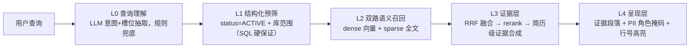

# 简历推荐 · 多租户人事招聘工作台（ATS）

> 五层 RAG 检索链路 + 招聘流程管理 + AI 助手（提议-确认-执行），基于精简版 MaxKB 内核构建。

---

## 项目简介

面向中小招聘团队的轻量招聘系统（ATS）：**上传简历 → 语义检索找人 → 挂到职位上走招聘流程 → AI 助手辅助筛选与沟通**。

两条原则贯穿始终：

- **AI 只建议，人做决策**——AI 不自动淘汰候选人、不发 Offer、不改招聘状态。
- **候选人数据与知识库隔离**——只收集招聘必需信息，联系方式按角色脱敏，全程审计留痕。

## RAG 检索链路（核心设计）

简历不靠人工打标签，一切查询走整条 RAG 链路：**解析 → 切片 → 三副本索引 → 查询理解 → 双路召回 → RRF 融合 → 重排 → 证据呈现**。

### 总体架构：五层检索



- **L0 查询理解**：一次 LLM 调用输出 `{intent, skills[], years_min, degree, city[], semantic_query}`；LLM 不可用时正则+词表规则兜底。`semantic_query` 剥离精确条件后才用于向量化，避免"5 年以上 Java"整句嵌入稀释语义。
- **L1 结构化预筛**：检索先锁定业务硬边界——`status=ACTIVE` + 简历库范围（总库/多业务库），由 SQL 100% 保证，不做向量近似；库范围经成员关系贯穿预筛、召回、重排与聚合，绝不越界。
- **L2 双路召回**：dense（pgvector 向量）+ sparse（tsvector 全文，配 Termbase 技能同义词）双路召回，限定在预筛集内执行。
- **L3 证据层**：`RRF(k=60)` 免调参融合 → `bge-reranker-v2-m3` 精排 → 段落主导分（rerank 分优先，缺省回落 RRF 分）→ 简历级聚合 `0.7·max(段分) + 0.3·avg(段分) + λ·log₂(1+命中段数)`（λ 默认 0，经 `MAXKB_HR_EVIDENCE_LAMBDA` 环境变量开启多段证据加分），命中简历给出证据段落（title+分数），HR 可逐条核验。
- **L4 呈现与合规**：简历卡片 = 结构化字段（`_mask_for_role` 角色掩码）+ 证据段引用 + 原文行号回溯高亮。

### 数据面：切片协议与三副本索引

简历先**清洗 + PII 掩码**（电话/邮箱/身份证行内替换，行号不变），然后**一次 LLM 调用**同时产出语义切片与技能列表——LLM 只给 `{title, start_line, end_line}` 边界（每段 50~500 字、行号必须全覆盖原文、title ≤20 字），程序校验（不重叠/全覆盖/上限）后按行号从原文**保真切割**；LLM 失败自动两级降级（`【区块】`规则切分 → 纯字符句读切分）。语义段再按句读边界切成 ≤100 字词段入库，每段同时落三份索引：

| 索引副本 | 技术 | 作用 |
|---|---|---|
| dense | pgvector 向量（bge-large-zh，512 token） | 语义召回 |
| sparse | tsvector 全文 | 关键词/技能同义词召回 |
| keyword | pg_trgm GIN 表达式索引（已落地） | 简历原文/段落内容的模糊匹配 |

### 降级链与评测

- **降级链**：LLM 挂 → 规则槽位 + browse；embed 挂 → sparse 单路；rerank 挂 → RRF 序；全挂 → 纯 SQL。**检索链路任何一环失效都不中断**。
- **关键取舍**：RRF 免调参（不用权重融合）；chunk+聚合而非 doc 级单向量（简历长，防语义稀释）；不引入 ColBERT / GraphRAG（简历实体关系简单，结构化字段 + SQL 已覆盖）。
- **评测基线**：`recall@5 = 0.92`、`MRR = 0.785`（dataset30，口径细节见设计文档）。

完整设计见 `docs/RAG-V2-DESIGN.md`（含消融计划与实施路线 P1–P3）。

## 招聘工作台（ATS）

- **简历库管理**：总库 + 多业务库、SHA-256 去重（同份简历只存一份）、库归档与库内检索。
- **招聘流程**：职位、候选人、申请、面试全流程；招聘阶段（Pipeline）可配置；状态迁移有守卫，非法操作一律拒绝。
- **全程审计**：每一步操作记入不可变账本（`ApplicationEvent`）；误拒绝可由管理员恢复并留痕。
- **AI 助手（D1–D4）**：简历初筛、JD/面试 Copilot、寻源与沟通草稿、Agent 工作台；初筛默认关闭，按工作区灰度开启。
- **权限与合规**：查看者 / 操作员 / 管理员三级权限；多租户隔离；PII 最小化。

## 核心对象

| 英文名 | 中文 | 说明 |
|---|---|---|
| `Candidate` | 候选人 | 人才库里的人，只登记姓名、手机号、邮箱和状态 |
| `Job` | 招聘需求 | 一项正在招人的职位，如"后端工程师 ×3" |
| `Application` | 申请流程 | 候选人和职位的绑定：渠道、进度、负责人——招聘流程的核心 |
| `Interview` | 面试 | 某候选人在某职位的面试轮次、面试官和反馈 |
| `ResumeFile` | 简历文件 | 上传的简历原件，去重、解析后进入检索索引 |
| `ApplicationEvent` | 流程事件 | 每次状态变更的不可变记录（审计账本） |

## 技术栈

- 后端：Python 3.11 · Django 5.2 · DRF · Celery（依赖用 uv 管理）
- 前端：Vue 3 · Element Plus · Vite
- 存储与检索：PostgreSQL（pgvector + tsvector + pg_trgm）· Redis
- 模型：OpenAI 兼容接口——Embedding `bge-large-zh`、Rerank `bge-reranker-v2-m3`、LLM 自备 API Key

## 快速开始

依赖：Python 3.11（uv）、PostgreSQL 15+（pgvector 扩展）、Redis 7、Node.js 18+。

```bash
# 1. 配置环境变量（写入 .env）
export MAXKB_CONFIG_TYPE=ENV \
  MAXKB_DB_NAME=maxkb MAXKB_DB_HOST=127.0.0.1 MAXKB_DB_PORT=5432 \
  MAXKB_DB_USER=postgres MAXKB_DB_PASSWORD=你的密码 \
  MAXKB_DB_ENGINE=django.db.backends.postgresql \
  MAXKB_REDIS_HOST=127.0.0.1 MAXKB_REDIS_PORT=6379 MAXKB_REDIS_PASSWORD=

# 2. 启动后端（自动建表 + 迁移，监听 8080）
python main.py dev

# 3. 启动前端（另开终端）
cd ui && npm install && npm run dev

# 4. 运行测试
uv run python manage.py test hr.tests application.tests knowledge.tests \
  models_provider.tests ops.tests common.tests --keepdb
```

生产部署见 `docs/DEPLOYMENT.md`；人事部操作手册见 `docs/HR-FRONTEND-GUIDE.md`。

## 项目文档

| 文档 | 内容 |
|---|---|
| `docs/RAG-V2-DESIGN.md` | **简历 RAG 五层检索设计**（本仓库核心） |
| `docs/PRD.md` | 产品基线：业务规则、状态机、上线门槛 |
| `docs/ATS-STATE-MACHINE-V2.md` | 目标 ATS 状态机设计 |
| `docs/PRD-AGENT-RAG.md` | AI 助手（Agent）设计 |
| `docs/HR-FRONTEND-GUIDE.md` | 人事部操作手册 |

## License

GPL-3.0，继承自 MaxKB；本项目的后续代码必须保持 GPL-3.0 开源。