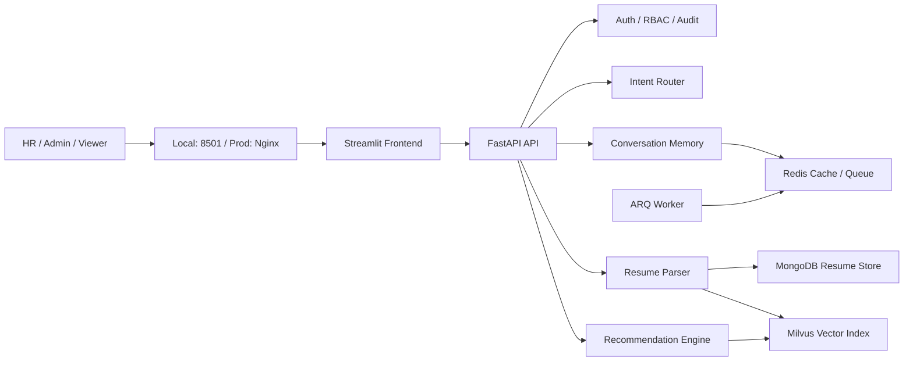

<div align="center">

# 🎯 Resume Recommender

**像和猎头对话一样找人才 — 智能招聘 RAG 推荐系统**

上传简历，用自然语言描述需求，系统秒级匹配最合适的候选人。

[](https://fastapi.tiangolo.com)
[](https://streamlit.io)
[](https://milvus.io)
[](https://mongodb.com)
[](https://docker.com)
[](LICENSE)

</div>

---

## ✨ 核心能力

| 能力 | 说明 |
|------|------|
| 🗣️ 自然语言搜人 | "帮我找 5 年经验的 Java 后端，base 杭州" → 系统自动抽取条件并检索 |
| 🔄 多轮对话记忆 | "再推几个""学历高一点""范围缩小到上海" — 连续追问无需重复 |
| 📄 简历解析入库 | PDF / DOCX / JSON 一键上传，自动结构化 + PII 脱敏 |
| 👥 候选人管理 | 查看、筛选、编辑、软删除、多人对比、会话历史 |
| 🔐 RBAC 权限 | `admin` / `hr` / `viewer` 三级角色，页面+接口双重控制 |
| 📊 运维可观测 | 健康检查、系统仪表盘、Swagger/ReDoc、容器探针 |

## 🏗️ 架构



**三类运行单元：**
- `FastAPI API` — 认证、意图路由、推荐引擎、简历解析
- `Streamlit Frontend` — 多页面交互界面
- `ARQ Worker` — 异步任务（上传/索引）

## 🚀 快速开始

### 1. 准备环境变量

```bash
cp .env.example .env
```

必填项：
- `LLM_API_KEY` / `OCR_API_KEY` / `RERANKER_API_KEY`
- `JWT_SECRET_KEY` / `PII_ENCRYPTION_KEY`
- `MONGODB_PASSWORD` / `REDIS_PASSWORD` / `MINIO_SECRET_KEY`
- `APP_ENV=dev`（本地开发）

### 2. 一键启动

```bash
docker compose up -d --wait
# 或 Windows:
.\start.bat
```

### 3. 访问

| 入口 | 地址 |
|------|------|
| 前端 | http://localhost:8501 |
| Swagger | http://localhost:8000/docs |
| ReDoc | http://localhost:8000/redoc |
| 健康检查 | http://localhost:8000/health |

### 4. 测试账号

| 用户名 | 密码 | 角色 |
|--------|------|------|
| `admin` | `admin123` | 管理员 |
| `hr` | `hr123` | HR |
| `viewer` | `viewer123` | 只读 |

## 🛠️ 技术栈

| 层面 | 技术 |
|------|------|
| 后端 | FastAPI + Uvicorn + Pydantic Settings |
| 前端 | Streamlit 多页面应用 |
| 对话引擎 | LangGraph + 自定义招聘工作流 |
| 向量检索 | Milvus 2.4（Dense + Sparse Hybrid Search） |
| 文档存储 | MongoDB |
| 缓存/队列 | Redis + ARQ |
| AI 能力 | 可配置 LLM / OCR / Embedding / Reranker Provider |
| 容器化 | Docker Compose + Nginx（生产） |

**Provider 可切换：**
```
LLM_PROVIDER / LLM_MODEL
OCR_PROVIDER / OCR_MODEL
EMBEDDING_PROVIDER / EMBEDDING_MODEL
RERANKER_PROVIDER / RERANKER_MODEL
```

## 📁 项目结构

```
src/
├── api/                    # FastAPI 接口、认证、上传、对话
├── common/                 # 配置、日志、JWT、权限中间件
├── intent_router/          # 意图分类、槽位抽取、回退策略
├── conversation_memory/    # 会话状态、上下文合并
├── recommendation_engine/  # Query Builder、混合检索、重排
├── resume_parser/          # 文本提取、OCR、结构化、PII
├── resume_store/           # MongoDB 仓储、脱敏、加密
├── vector_index/           # Embedding、Milvus Collection 管理
└── frontend/               # Streamlit 多页面 + API Client
```

## 🏭 生产部署

```bash
# 构建镜像
docker build -f docker/Dockerfile.api -t resume-rag-app:latest .
docker build -f docker/Dockerfile.frontend -t resume-rag-frontend:latest .

# 启动生产栈（Nginx 统一入口）
docker compose -f docker-compose.prod.yml up -d
```

生产入口：`http://localhost`（前端）+ `/api`（API 反代）

## 🧪 开发与测试

```bash
docker compose exec app pytest -v
docker compose exec app ruff check src tests
docker compose logs -f app frontend arq-worker
```

## 📄 License

MIT © [wzjames3-maker](https://github.com/wzjames3-maker)

---

<div align="center">

**用自然语言重新定义招聘搜索。**

觉得有用？给个 ⭐ 吧！

</div>
