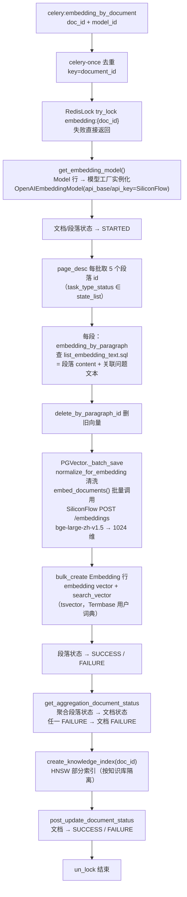
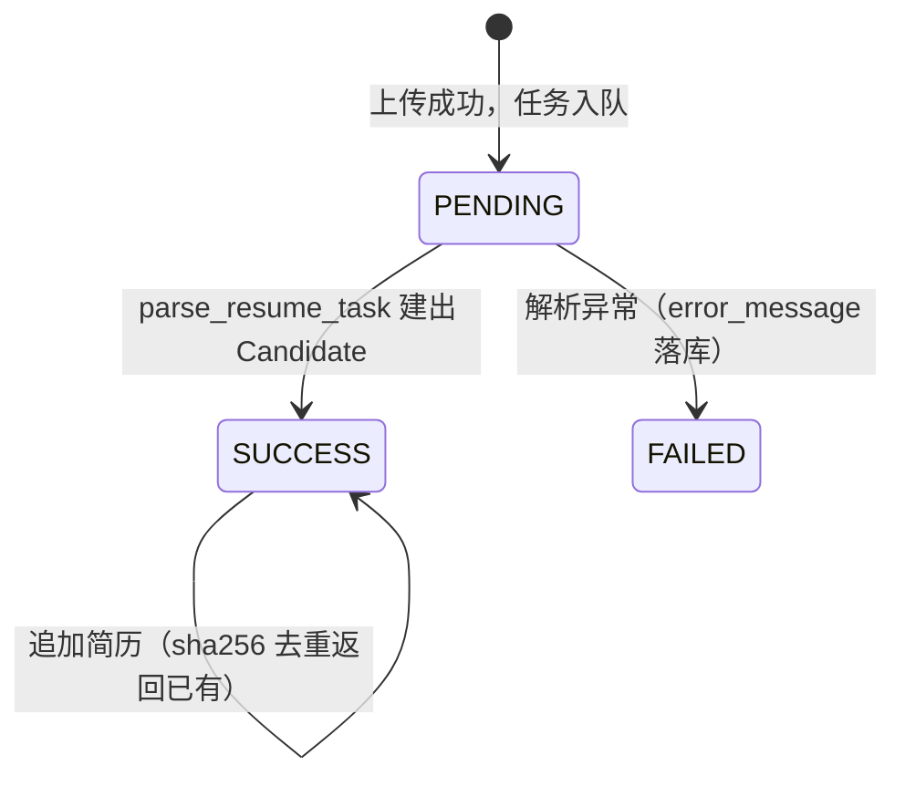
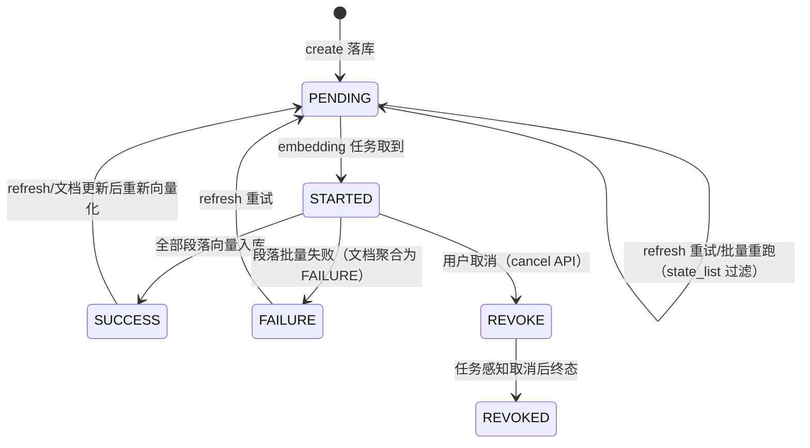
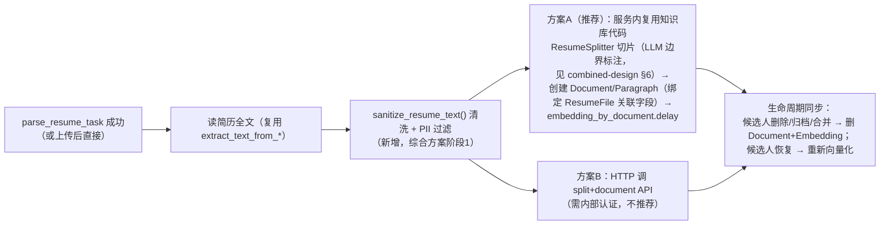

# 简历上传 → 文档切片 → 向量化 流程图（实现现状）

> 日期：2026-08-15
> 状态：**辅助文档（链路流程图）**——规范与选型以 2026-08-15-end-to-end-pipeline-combined-design.md（权威）为准；实施顺序见 ../plans/2026-08-15-c-stage-resume-rag.md
> 范围：以真实代码为准梳理「简历进入语义索引」的完整链路。链路 A（HR 简历上传→解析建候选人）与链路 B（知识库切片→向量化）**已于 2026-08-15 打通**（阶段 2 交付：parse_resume_task 自动清洗→LLM 切片→建 Document→向量化，失败不阻塞建档；详见 HANDOFF §5.3）。§8 原为打通方案，现已实现，保留作为链路说明。

---

## 1. 总览

```mermaid
flowchart TD
    subgraph A["链路 A：HR 简历上传（已实现，止步于 Candidate）"]
        U["前端上传<br/>POST /admin/api/workspace/{ws}/hr/candidates/resumes"]
        U --> V1["ResumeAPI.post<br/>hr_access_required / 操作人权限"]
        V1 --> V2["upload_resumes()<br/>① 扩展名校验 docx/txt<br/>② 大小 ≤ 20MB<br/>③ source_channel 校验"]
        V2 --> V3{"sha256 同 workspace 查重"}
        V3 -- "重复" --> V4["返回已有记录<br/>duplicate=true"]
        V3 -- "新文件" --> V5["对象存储保存<br/>LocalStorage data/resume/{ws}/{sha256}.{ext}<br/>或 S3Storage（MAXKB_STORAGE_BACKEND）"]
        V5 --> V6["创建 ResumeFile<br/>status = PENDING"]
        V6 --> V7["parse_resume_task.delay(resume_id)<br/>celery-once，key=resume_id"]
        V7 --> V8["Celery: celery:hr_parse_resume<br/>读文本 docx→python-docx / txt→utf-8,gbk 兜底"]
        V8 --> V9["parse_resume_text()<br/>规则抽取：姓名/邮箱/手机/城市/学历/年限/技能/经历<br/>（不调用模型）"]
        V9 --> V10["创建 Candidate<br/>ResumeFile.status = SUCCESS"]
        V9 -. 异常 .-> V11["ResumeFile.status = FAILED<br/>error_message 落库"]
        V10 --> GAP{{"✗ 缺口：此处结束，<br/>没有切片、没有向量化"}}
    end

    subgraph B["链路 B：知识库切片 + 向量化（已实现，pilot 手工走此路）"]
        S1["POST /admin/api/workspace/{ws}/knowledge/{kid}/document/split<br/>multipart: file + limit(默认4096) + patterns + with_filter"]
        S1 --> S2["DocumentView.Split<br/>Split.parse() → file_to_paragraph()"]
        S2 --> S3["① 源文件落 File 表<br/>FileSourceType.KNOWLEDGE，uuid7"]
        S3 --> S4["② 按类型选 SplitHandle<br/>txt/md → TextSplitHandle；docx 按内容嗅探<br/>还有 HTML/Doc/Pdf/Xlsx/Xls/Csv/Zip"]
        S4 --> S5["③ SplitModel(patterns, with_filter, limit)<br/>parse_to_tree() 标题分层<br/>无标题 → smart_split_paragraph()"]
        S5 --> S6["输出 [{title, content, source_file_id}]"]
        S6 --> C1["POST /admin/api/workspace/{ws}/knowledge/{kid}/document<br/>JSON: name + source_file_id + paragraphs[]"]
        C1 --> C2["DocumentSerializer.Create<br/>校验知识库 embedding 模型存在"]
        C2 --> C3["创建 Document<br/>status=PENDING，meta.source_file_id"]
        C3 --> C4["bulk_create Paragraph<br/>status=PENDING，position 递增"]
        C4 --> C5["embedding_by_document.delay(doc_id, model_id)<br/>入 Redis 队列"]
        C5 --> C6["Celery: celery:embedding_by_document<br/>celery-once key=document_id + RedisLock"]
        C6 --> C7["get_embedding_model()<br/>Model 行 → OpenAIEmbeddingModel<br/>（SiliconFlow bge-large-zh-v1.5，1024 维）"]
        C7 --> C8["文档/段落状态 → STARTED<br/>page_desc 每批 5 段"]
        C8 --> C9["每段 embedding_by_paragraph<br/>查段落+关联问题文本（list_embedding_text.sql）<br/>删旧向量 → PGVector._batch_save"]
        C9 --> C10["normalize_for_embedding → embed_documents()<br/>批量调 SiliconFlow /embeddings"]
        C10 --> C11["bulk_create Embedding 行<br/>向量 + tsvector search_vector（Termbase 词典）<br/>段落 → SUCCESS / FAILURE"]
        C11 --> C12["每批聚合文档状态<br/>create_knowledge_index（HNSW 部分索引）"]
        C12 --> C13["post_update_document_status<br/>文档 → SUCCESS / FAILURE"]
    end

    GAP -. "打通（§8）" .-> S1
```



---

## 2. 链路 A：简历上传（HR 业务侧）

### 2.1 接口

| 项 | 值 |
|---|---|
| URL | `POST /admin/api/workspace/{workspace_id}/hr/candidates/resumes` |
| 请求 | multipart/form-data：`files`（多文件）+ `source_channel` |
| 视图 | `apps/hr/views/recruitment.py::ResumeAPI` |
| 服务 | `apps/hr/serializers/recruitment.py::upload_resumes()` |
| 权限 | `hr_access_required` + 操作人角色 |
| 审计 | `write_audit_log(..., "RESUME_UPLOAD", ...)` |

### 2.2 处理步骤

1. **校验**：扩展名仅 `docx` / `txt`（小写化）；单文件 ≤ 20MB；`source_channel` 必须在 `ResumeChannel.values` 内。
2. **去重**：对每个文件计算 `sha256`，同 workspace 内已存在 → 直接返回已有记录（`duplicate=true`），不再重复存储。
3. **存储**：`get_storage().save("resume/{ws}/{sha256}.{ext}", 临时文件)`。后端抽象见 `apps/hr/services/storage.py`：
   - `LocalStorage`（默认）：落 `{PROJECT_DIR}/data/resume/...`；
   - `S3Storage`：`MAXKB_STORAGE_BACKEND=s3` + `MAXKB_S3_*` 环境变量（MinIO/S3 兼容），`open()` 物化到临时文件。
   - 保存成功后删除上传临时文件（`os.remove(file_path)`）。
4. **落库**：创建 `ResumeFile` 行（`status=ResumeStatus.PENDING`）。
5. **异步解析**：`parse_resume_task.delay(str(resume.id))`——`celery-once`（key=`resume_id`），已排队再投递抛 `AlreadyQueued`。

### 2.3 异步解析任务（Celery `celery:hr_parse_resume`）

```mermaid
flowchart LR
    A[parse_resume_task resume_id] --> B{ResumeFile 存在?}
    B -- 否 --> X[直接返回]
    B -- 是 --> C[storage.open 取本地路径]
    C --> D{extension}
    D -- docx --> E[extract_text_from_docx<br/>python-docx 按段落拼接]
    D -- txt --> F[extract_text_from_txt<br/>utf-8 → gbk 兜底]
    E --> G[parse_resume_text 规则抽取]
    F --> G
    G --> H[事务内创建 Candidate<br/>姓名兜底 file_name]
    H --> I[ResumeFile.status = SUCCESS]
    G -. 异常 .-> J[ResumeFile.status = FAILED<br/>error_message = str(exc)]
```

- 抽取器 `parse_resume_text()`（`apps/hr/services/resume_parser.py`）为**纯规则**实现：正则提取姓名/邮箱/手机/城市/最高学历/工作年限/技能列表，教育经历与工作经历整段截入 `note`；**不调用任何模型**，无法确定一律留空。
- 孤儿简历每日 03:00 清理：`cleanup_orphan_resumes`（`candidate__isnull=True` 且超 30 天），由 `worker_ready` 注册的 django-celery-beat 周期任务驱动。

---

## 3. 链路 B-1：文档切片（split）

### 3.1 接口

| 项 | 值 |
|---|---|
| URL | `POST /admin/api/workspace/{ws}/knowledge/{knowledge_id}/document/split` |
| 请求 | multipart：`file`、`limit`（默认 4096，clamp [50, 100000]）、`patterns`（分段正则）、`with_filter`（清特殊字符） |
| 序列化器 | `apps/knowledge/serializers/document.py::DocumentSerializers.Split` |
| 视图 | `apps/knowledge/views/document.py`（路由 `apps/knowledge/urls.py:33`） |

### 3.2 处理步骤（`Split.parse` → `file_to_paragraph`）

1. **校验**：knowledge 存在且属于 workspace；文件大小 ≤ `knowledge.file_size_limit` MB。
2. **源文件落库**：创建 `File` 行（`source_type=FileSourceType.KNOWLEDGE`，`source_id=knowledge_id`），`file.save(bytes)` 持久化原始文件，随后 `file.seek(0)` 继续读。
3. **分派 SplitHandle**（`split_handles` 顺序匹配 `support(file, get_buffer)`）：
   `HTMLSplitHandle → DocSplitHandle → PdfSplitHandle → XlsxSplitHandle → XlsSplitHandle → CsvSplitHandle → ZipSplitHandle → TextSplitHandle`（默认兜底）。
   - 简历常见 `txt`：`TextSplitHandle.support` 直接按扩展名命中；`docx` 无专用 handle，落入文本嗅探分支（`charset_normalizer` 检测编码且非 ascii、置信度 > 0.5 → 按文本处理）。
4. **切片模型**：`SplitModel(default_pattern_list, with_filter, limit)`，`parse_to_tree()`：
   - 先用 markdown 标题正则（`parse_title_level`）识别标题层级；**简历通常无标题** → 整篇走 `smart_split_paragraph`；
   - `with_filter=True` 时对每段执行 `filter_special_char`：压缩连续换行/空格、剥离 `#`/`\t`。
5. **输出**：`[{name, content: [{title, content}], source_file_id}]`——`source_file_id` 即第 2 步 `File` 的 uuid7。**此步不落 Paragraph 表、不触发向量化**，纯预览/分段。

### 3.3 `smart_split_paragraph(content, limit)` 算法

```mermaid
flowchart TD
    A[content ≤ limit?] -- 是 --> Z[返回单段]
    A -- 否 --> B[从 start 起取窗口 [start, start+limit)]
    B --> C{窗口内有分段点?}
    C -- 是 --> D[从窗口末尾向前扫描<br/>优先级：。 . ！ ! ？ ?<br/>约束：至少保留一半窗口<br/>命中即包含分隔符切段]
    C -- 否 --> E[按 limit 硬切]
    D --> F[start = 切点]
    E --> F
    F --> G{剩余文本?}
    G -- 是 --> B
    G -- 否 --> H[过滤空段后返回]
```

---

## 4. 链路 B-2：文档创建 + 向量化

### 4.1 接口

| 项 | 值 |
|---|---|
| URL | `POST /admin/api/workspace/{ws}/knowledge/{knowledge_id}/document` |
| 请求 | JSON `{name, source_file_id, paragraphs: [{content, title, problem_list}]}` |
| 序列化器 | `apps/knowledge/serializers/document.py::DocumentSerializers.Create` |

### 4.2 创建步骤（事务内）

1. 校验知识库存在、`embedding_model_id` 指向已注册的 EMBEDDING 模型（否则 `Model does not exist`）。
2. 创建 `Document` 行：`type=BASE`，`status` 置 `PENDING`，`meta.source_file_id`。
3. `bulk_create` `Paragraph` 行：`status=PENDING`，`position` 按序递增，`content/title` 来自 split 结果。
4. 若有 `problem_list`：建 `Problem` + `ProblemParagraphMapping`（"问题"会被额外向量化，pilot 未使用）。
5. **触发向量化**：`embedding_by_document.delay(document_id, embedding_model_id)`（Redis 队列 `model`）。

### 4.3 向量化任务（Celery `celery:embedding_by_document`）



### 4.4 关键实现位置

| 环节 | 位置 |
|---|---|
| 任务入口 | `apps/knowledge/task/embedding.py::embedding_by_document` |
| 文档级编排 | `apps/common/event/listener_manage.py::ListenerManagement.embedding_by_document`（RedisLock + page_desc 分批 + 状态聚合） |
| 段落级 | `ListenerManagement.embedding_by_paragraph`（查文本 → 删旧 → batch_save → 状态） |
| 状态写入 | `ListenerManagement.update_status`（位运算 SQL `update_paragraph_status.sql`，`status` 字段按 `TaskType` 位存储多任务状态） |
| 向量落库 | `apps/knowledge/vector/pg_vector.py::PGVector._batch_save` |
| 模型调用 | `apps/models_provider/impl/openai_model_provider/model/embedding.py`（SiliconFlow OpenAI 兼容 `/embeddings`，**不支持** `dimensions` 参数） |
| 索引 | `create_knowledge_index`（`apps/knowledge/` sql，HNSW 部分索引，`WHERE knowledge_id = ...`） |

---

## 5. 数据落表

| 表 | 关键字段 | 说明 |
|---|---|---|
| `hr_resumefile` | workspace_id, file_name, extension, file_path, sha256, source_channel, **status**(PENDING/SUCCESS/FAILED), candidate_id | 简历原件元数据；`file_path` 指向对象存储 |
| `hr_candidate` | name, email, phone, current_city, target_city, highest_degree, years_experience, skills, note | 规则解析出的结构化候选人 |
| `knowledge_file` | file_name, file_size, source_type=KNOWLEDGE, source_id | split 时保存的源文件 |
| `knowledge_document` | knowledge_id, name, type, status, meta.source_file_id | 知识库文档（= 一份简历） |
| `knowledge_paragraph` | document_id, content, title, position, status | 切片段落 |
| `knowledge_embedding` | knowledge_id, document_id, paragraph_id, source_id, source_type, embedding(vector), search_vector(tsvector), is_active | 向量 + 全文检索双路索引 |

> `Document.status` / `Paragraph.status` 是位图：`TaskType`（如 EMBEDDING=2）占一位，`State`（PENDING=0/STARTED=1/SUCCESS=2/FAILURE=3/REVOKE=4/REVOKED=5）写入对应位——所以一个状态字段同时记录 sync/embedding/tokenize 多任务进度。

---

## 6. 状态机

### 6.1 ResumeFile（HR 侧）



### 6.2 Document / Paragraph（知识库侧，EMBEDDING 任务位）



---

## 7. 现状缺口（关键结论）

1. **HR 上传的简历不进入语义索引**：`parse_resume_task` 只建 `Candidate`；知识库侧（§3/§4）只在 pilot 中由脚本**手工调用 API** 完成。
2. 因此当前 HR 的语义检索能力**为零**：只有结构化字段查询（B 阶段）可用；简历正文（技能细节、项目经历描述）不可检索。
3. 反之，知识库侧的切片/向量化链路**已完整可用**，且经过真实模型端到端验证（S1/S2 报告：30 份简历 30/30 向量化成功、chat 带 3 条引用）。

---

## 8. 打通方案（已实现，2026-08-15 阶段 2 交付）

目标：`upload_resumes` 成功后，简历正文自动走「清洗 → 切片 → 建文档 → 向量化」，并随候选人生命周期同步清理。**已实现**：parse_resume_task 内调用 index_resume（hr/services/resume_index.py）完成清洗→切片→Document/Paragraph→embedding_by_document；删除/合并/归档/恢复同步生命周期；流转日志记录 UPLOAD/EXTRACT/SANITIZE/SPLIT/DOCUMENT/LIFECYCLE 节点。**端到端选型（含检索流水线）以 2026-08-15-end-to-end-pipeline-combined-design.md 为权威。**



### 设计要点

- **复用而非复制**：切片采用 `ResumeSplitter`（LLM 边界标注主干 + 规则降级，**协议见 combined-design §6**）；建文档/向量化复用 `DocumentSerializers.Create` 与 `embedding_by_document`；HR 任务内以服务调用方式完成（不走 HTTP，避免认证与超时问题）。
- **简历知识库**：每个 workspace 一个内部知识库（`Knowledge` 行，`embedding_model_id = bge-large-zh-v1.5`），或按需延迟创建；HR 侧需记录 `ResumeFile → Document` 关联（新字段 `document_id`）。
- **PII 治理**（PRD §6）：入库文本默认不包含手机号；邮箱/姓名由业务决定是否保留（pilot 已明确 strip phone，可扩展到邮箱）。
- **生命周期同步**（PRD §9.2 C 阶段完成定义）：
  - 候选人删除/合并 → `delete_embedding_by_document` + Document 行删除；
  - 候选人归档 → Document `is_active=False`（向量 `is_active=False`，检索自动排除）；
  - 简历替换（sha256 变化）→ 重建 Document 段落与向量。
- **失败可观测**：`ResumeFile.status` 语义扩展（如 `INDEXED`）或在 `meta` 中记录索引任务状态；`error_message` 记录向量化失败原因；提供重试入口（复用 `refresh`）。
